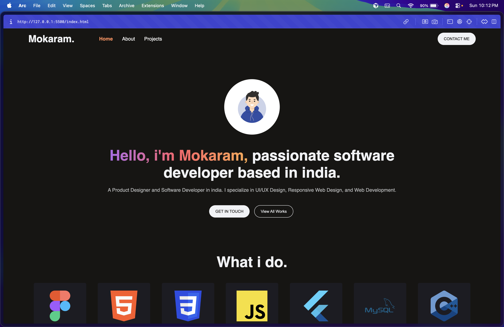
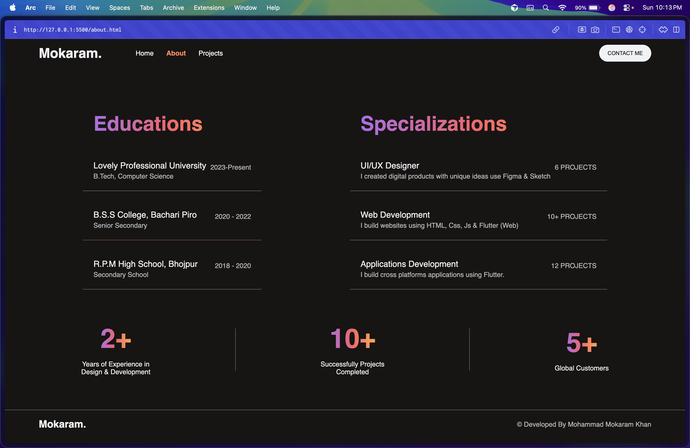
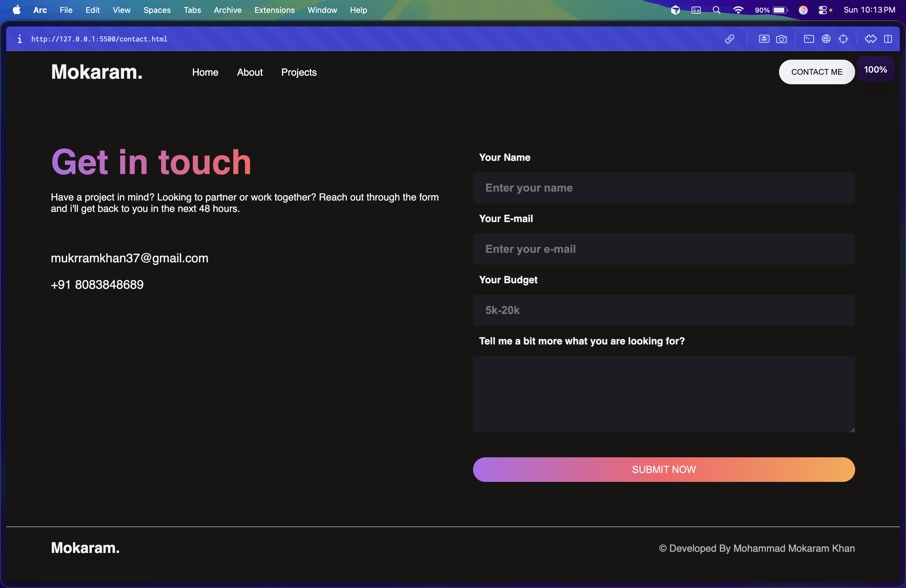
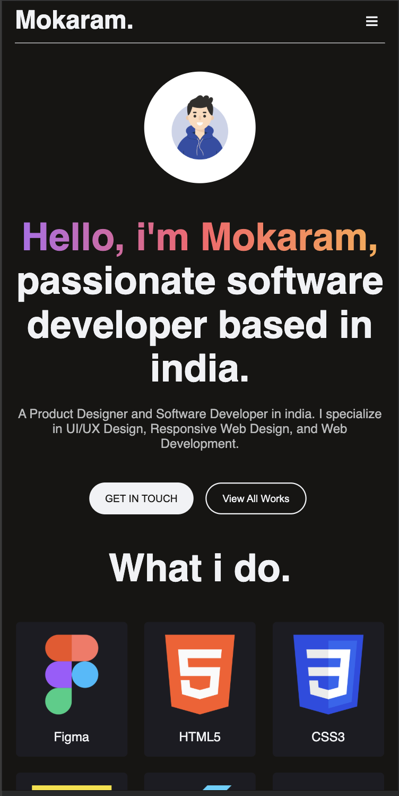
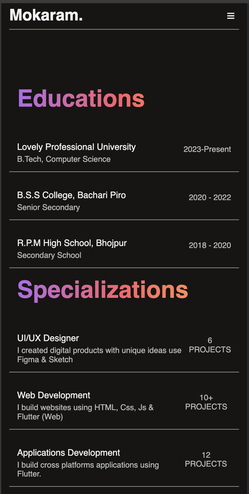
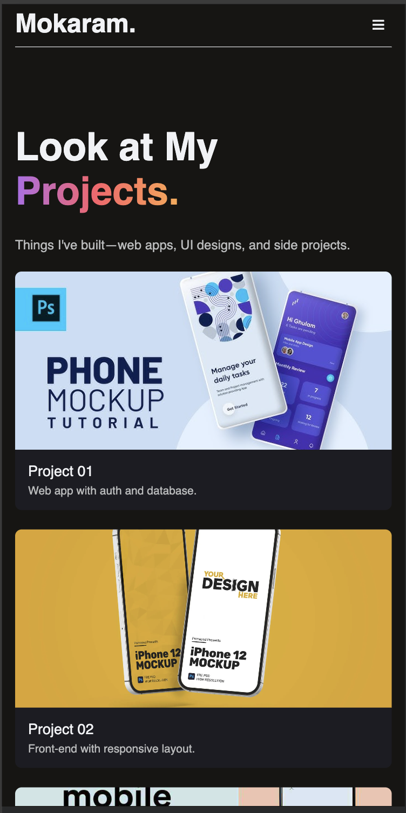
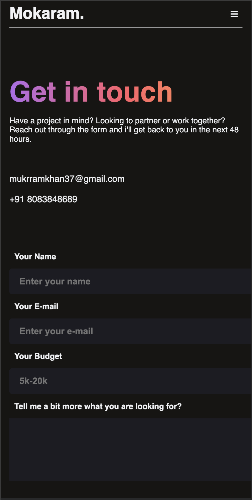

# Mini Project: Responsive Portfolio Website

## Project Description

A responsive personal portfolio site showcasing skills, projects, and contact info. Includes a multi-page layout (Home, About, Projects, Contact) with a mobile-friendly navigation and breakpoints for tablet and phone.

## Tech Stack

- **HTML5**
- **CSS3** (Flexbox, Grid, media queries)
- **JavaScript** (scroll behavior, mobile nav toggle)

## Screenshots

**Desktop**

|  |  |  |  |
|--|--|--|--|
|  |  |  |  |

**Mobile**

|  |  |  |  |
|--|--|--|--|
|  |  |  |  |

## Live Link (GitHub Pages)

**Live site:** [https://mdmokaramkhan.github.io/portfolio-mini-project/](https://mdmokaramkhan.github.io/portfolio-mini-project/)

## What I Learned

- Using **media queries** (768px and 480px) to adapt layout and typography for different screen sizes
- Building a **mobile navigation** with a hamburger toggle and CSS transitions
- Structuring a multi-page site with **nav** and **footer** and consistent styling
- Using **Flexbox** and **CSS Grid** for responsive sections (skills grid, cards, forms)
- Handling **scroll** and **click** events in JS (nav border on scroll, menu open/close)
